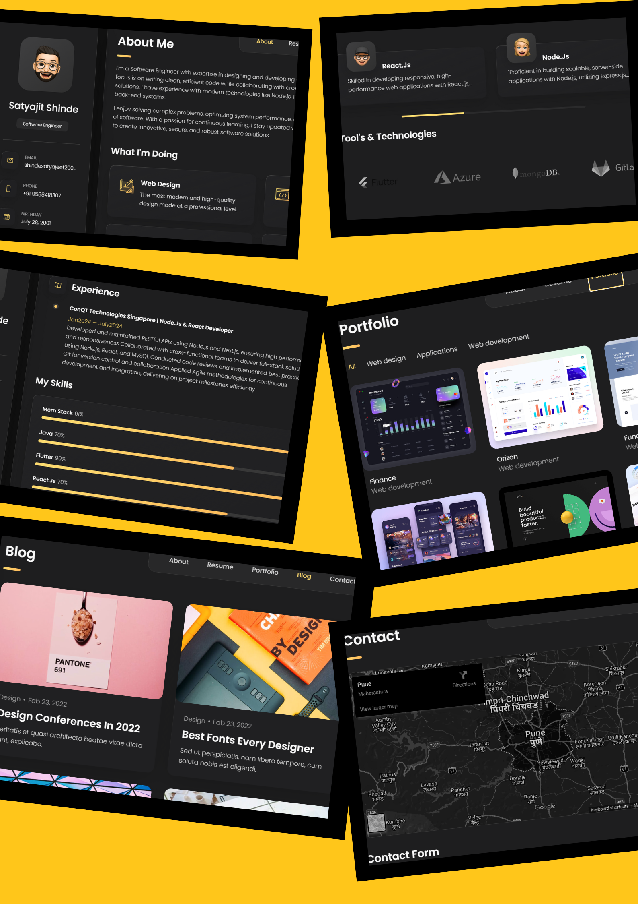

# Satyajit's - Personal portfolio


<!--  -->

[](https://www.linkedin.com/in/satyajit0333)


 fully responsive personal portfolio website, responsive for all devices, built using HTML, CSS, and JavaScript.

## Demo




## Prerequisites

Before you begin, ensure you have met the following requirements:

* [Git](https://git-scm.com/downloads "Download Git") must be installed on your operating system.

## Installing 

To install ****, follow these steps:

Linux and macOS:

```bash
sudo git clone https://github.com/SatyajitShinde0333/Satyajit_Personal_Portfolio.git

Windows:

```bash
git clone https://github.com/SatyajitShinde0333/Satyajit_Personal_Portfolio.git
```

## Contact

If you want to contact me you can reach me at [Twitter](https://www.linkedin.com/in/satyajit0333).

## License

Code With Satyajit..
